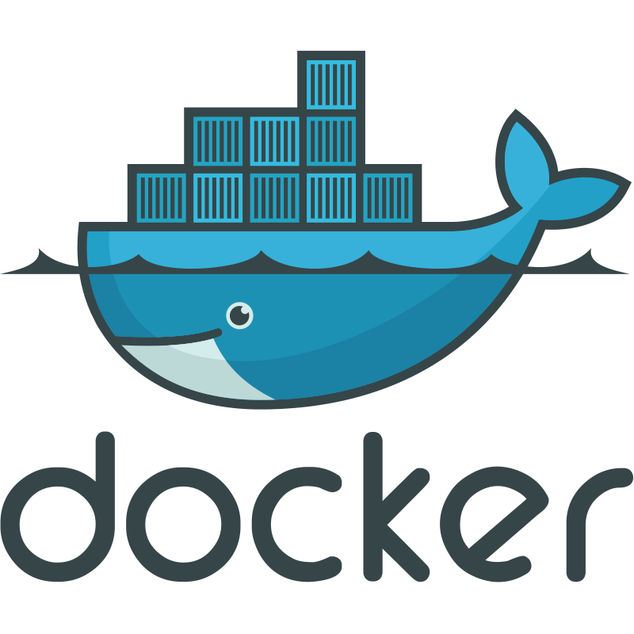

# Olá, eu sou Maxsuel David Oliveira 🙂

💻 Desenvolvedor Full Stack · Node.js • React · Automação & RPA

Sou um apaixonado por tecnologia e automação. Tenho experiência com front-end, back-end e operações de infraestrutura (DevOps). Atualmente estou cursando ADS, estou trabalhando como freelancer e já lidei com alguns projetos que envolveram desde a implementação do frontend até a configuração de servidores nuvem (NGINX, certificados SSL, firewall, PostgreSQL, Redis, entre outros).

---

## 🛠 Tecnologias

  
  
  
  
  

---

## ✨ Projetos de uso real

- **Helpdesk** — Plataforma de atendimento via WhatsApp para