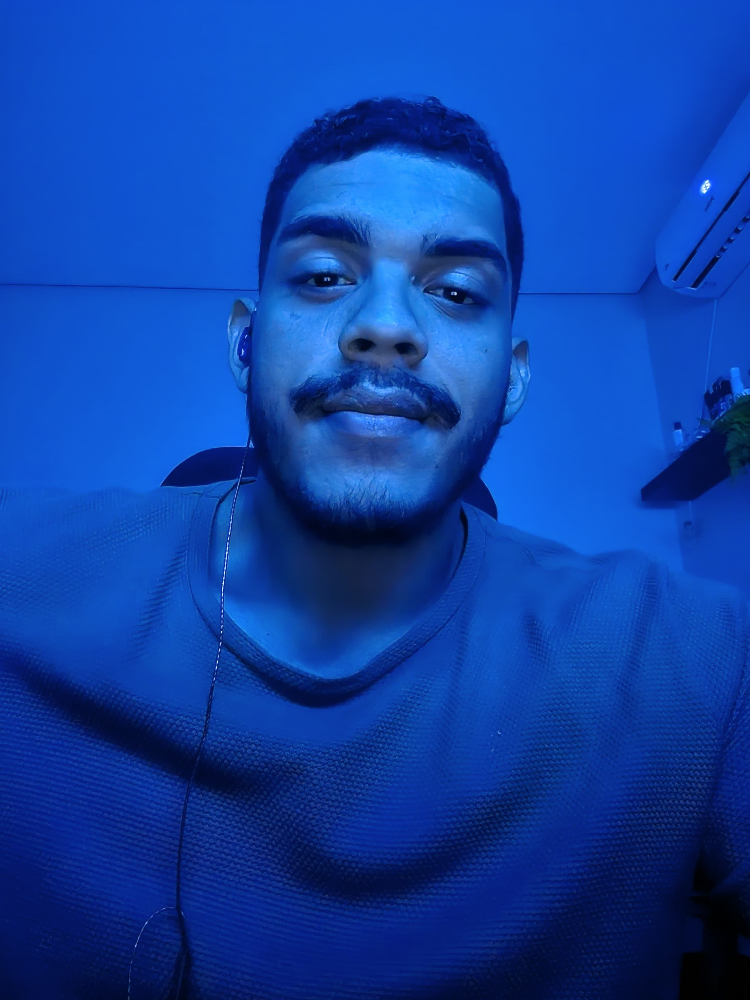

  

  <!-- Imagem/Profile -->
  

    
  

  <h1 class="text-center profile_name">I'm Maxsuel David Oliveira! 😐</h1>
  

    💻 Develop FullStack JavaScript | React JS | React Native | Node.js | Microservices | Python | RPA.  
    <svg stroke="currentColor" fill="none" stroke-width="0" width="16" height="16" viewBox="0 0 24 24" xmlns="http://www.w3.org/2000/svg" class="text-gray-200"><path fill-rule="evenodd" clip-rule="evenodd" d="M12.0015 1.25C8.17538 1.25 4.52505 3.51253 2.99714 7.08468C1.57518 10.4086 2.34496 13.2373 3.94771 15.6595C5.26177 17.6454 7.17835 19.4178 8.90742 21.0168L8.90824 21.0175C9.23768 21.3222 9.56031 21.6206 9.87066 21.9129L9.87231 21.9145C10.4473 22.4528 11.2112 22.75 12.0015 22.75C12.7919 22.75 13.5558 22.4528 14.1258 21.9144C14.4243 21.6396 14.7286 21.3592 15.039 21.0732C16.7869 19.4628 18.7254 17.672 20.0582 15.6609C21.6591 13.2362 22.4261 10.4045 21.0059 7.08468C19.478 3.51253 15.8277 1.25 12.0015 1.25ZM12 7C9.79086 7 8 8.79086 8 11C8 13.2091 9.79086 15 12 15C14.2091 15 16 13.2091 16 11C16 8.79086 14.2091 7 12 7Z" fill="currentColor"></path></svg> Brazil
  

  

  
    JAVASCRIPT
  

  

    
    NODEJS
  

  

    
      REACT NATIVE
  

  

    
      PYTHON
  

  

    
      FLASKY
  

  <h1 id="about_title">👨‍💻 Sobre mim</h1>
  

  Olá! Me chamo Maxsuel David, sou um desenvolvedor apaixonado por tecnologia. Minha jornada começou cedo, com pequenos scripts em <code>.bat</code>, depois experimentando o <b>Google Sites</b>, até que mergulhei de vez em <b>HTML</b> e <b>PHP</b>. Com o tempo, vieram os cursos e, mais tarde, o <b>IFBA</b>, onde tive a oportunidade de fazer meu primeiro trabalho como <b>freelancer</b>, usando <b>HTML, CSS, PHP, MySQL</b> e <b>JavaScript</b>.  
  Desde então, desenvolvi diversos projetos como <b>freelancer</b>: <u>Desde links de pedidos integrados a sistemas de delivery, até plataformas de gestão de pedidos para óticas, sites institucionais e um sistema completo de avaliação de clientes.</u>  
  No meio do caminho, enfrentei frustrações, prazos apertados, bugs inesperados, sistemas quebrando e noites mal dormidas. Cada obstáculo moldou minha trajetória e me fortaleceu como desenvolvedor.  
  Em 2024, decidi me aventurar no universo do <b>JavaScript</b>, impulsionado pelo crescimento da linguagem. No entanto, a rotina intensa acabou limitando meu tempo para me aprofundar. Mas 2025 chegou como um recomeço: agora, com foco total em <b>JavaScript</b> e <b>RPA</b>, estou reconstruindo minha carreira com mais maturidade, disciplina e paixão.  
  Afinal, não somos uma <code>const</code> — tudo muda, tudo evolui, tudo pode (e deve) ser refatorado. Estou redescobrindo esse universo e cada dia mais fascinado por ele. Fique à vontade para acompanhar minha jornada no <b>backend</b> com <b>JavaScript</b> e automações com <b>RPA</b>.

  <h1 id="stacks-title">🚀 Tecnologias</h1>
  

  Um pouco das tecnologias que eu já conheço e estou conheçendo.
  

<table>
<tbody>
<tr>
  <td>
    

      
      PYTHON
    

  </td>
  <td>
    

      Elaborando várias ideias, desde scraping até chatbots.
    

  </td>
</tr>
<tr>
  <td>
    

      
      DOCKER
    

  </td>
  <td>
    

      Empacotando microserviços e testando tudo em containers.
    

  </td>
</tr>
<tr>
  <td>
    

      
      ORACLE
    

  </td>
  <td>
    

      Consultas robustas e integrações em sistemas legados.
    

  </td>
</tr>
<tr>
  <td>
    

      
      JAVASCRIPT
    

  </td>
  <td>
    

      Meu universo atual: lógica, eventos e muita DOM.
    

  </td>
</tr>
<tr>
  <td>
    

      
      FIGMA
    

  </td>
  <td>
    

      Protótipos rápidos pra transformar ideias em tela.
    

  </td>
</tr>
<tr>
  <td>
    

      
      NODE.JS
    

  </td>
  <td>
    

      Backend leve, rápido e cheio de automações.
    

  </td>
</tr>
<tr>
  <td>
    

      
      REACT
    

  </td>
  <td>
    

      UIs dinâmicas com muita responsividade e hooks.
    

  </td>
</tr>
<tr>
  <td>
    

      
      SQLITE
    

  </td>
  <td>
    

      Simples, direto e perfeito pra projetos locais.
    

  </td>
</tr>
<tr>
  <td>
    

      
      TAILWIND CSS
    

  </td>
  <td>
    

      Estilo rápido, prático e com utilitários em tudo.
    

  </td>
</tr>
<tr>
  <td>
    

      
      EXPRESS.JS
    

  </td>
  <td>
    

      Minha base para APIs rápidas e bem organizadas.
    

  </td>
</tr>
<tr>
  <td>
    

      
      MONGODB
    

  </td>
  <td>
    

      Schema flexível e fácil de escalar com Node.
    

  </td>
</tr>
<tr>
  <td>
    

      
      CSS3
    

  </td>
  <td>
    

      Estilizando desde os tempos do float: left.
    

  </td>
</tr>
<tr>
  <td>
    

      
      POSTMAN
    

  </td>
  <td>
    

      Testando, documentando e validando todas as rotas.
    

  </td>
</tr>
<tr>
  <td>
    

      
      GIT
    

  </td>
  <td>
    

      Versionando tudo com responsabilidade (e uns commits nervosos).
    

  </td>
</tr>
</tbody>
</table>

  <h1 id="project-title">
  ✨ Projetos em destaque
  </h1>
  

    <h2>
      Próton ERP
    </h2>
    

      Descrição do projeto
    

    <ul>
      <li>
        Node.js  Usado para construir o meu backend.
      </li>
      <li>
        Postgress Banco de dados
      </li>
      <li>
        Docker Upload de um microservice que é a consulta por onde fica o backend.
      </li>
      <li>
        React JS  Frontend para o cliente.
      </li>
    </ul>
  

  

    <h2>EstoqueFácil</h2>
    

      App de contagem de estoque com leitura de planilhas e scanner de códigos de barras.
    

    <ul>
      <li>
        React Native Usado para desenvolver o app mobile.
      </li>
      <li>
        JavaScript Base de toda a lógica da aplicação.
      </li>
      <li>
        XLSX Importação e leitura de planilhas.
      </li>
      <li>
        Expo Facilitou o build e testes no celular.
      </li>
    </ul>
  

  

    <h2>Avaliali</h2>
    

      Sistema completo para avaliação de clientes com painel administrativo.
    

    <ul>
      <li>
        Node.js Backend para controle das avaliações.
      </li>
      <li>
        SQLite Banco leve e direto no servidor.
      </li>
      <li>
        JavaScript Usado tanto no backend quanto em scripts do frontend.
      </li>
      <li>
        HTML + CSS Base do painel de administração.
      </li>
    </ul>
  

  <h1 id="statics-title">
    Estatísticas GitHub
  </h1>
  

  Desculpe a ausencia aqui no meu github... embreve novas atualizações.
  

  

    <h1 id="statics-rocktseat__title">
      Estatísticas Rocketseat
    </h1>
  

  Há tempos sonho em fazer parte da Rocketseat. Em 2025, finalmente me tornei aluno — e quem sabe, em breve, algo ainda maior aconteça, né @rocketseat? <a href="https://app.rocketseat.com.br/me/md-04583" title="Dá um pulo aqui" target="new_blank">🚀 Acompanhe minha jornada por aqui!</a>
  

  

  

  
  
  
  
  

  

  

    <h2>
    ✨ Sempre aprendendo, sempre evoluindo. Obrigado por visitar meu perfil! 🚀
    </h2>
  

