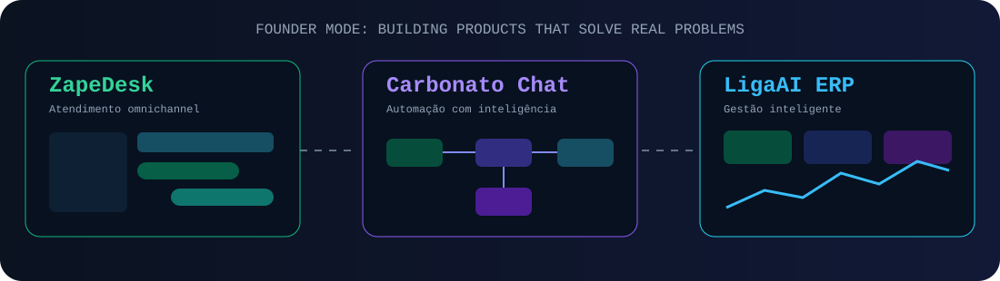
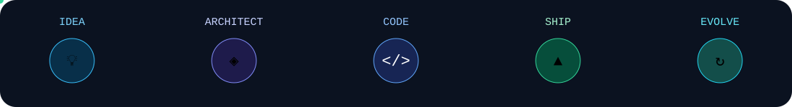

<div align="center">



<br/>

<a href="https://github.com/MaxsuelOliveira">
  
</a>

<br/>

[](https://github.com/MaxsuelOliveira)
[](https://github.com/MaxsuelOliveira?tab=followers)
[](https://github.com/MaxsuelOliveira)

</div>

---

## `$ cat developer.ts`

```ts
const maxsuel = {
  role: "Senior Full Stack Software Engineer",
  builds: ["SaaS platforms", "RPA automations", "AI-powered products"],
  worksWith: ["Web", "APIs", "Databases", "Infrastructure", "Integrations"],
  approach: "Understand the business, design the architecture, ship the product",
  currentFocus: "Turning complex operations into simple software"
};
```

Sou desenvolvedor Full Stack e construo produtos digitais de ponta a ponta: entendimento do problema, arquitetura, backend, frontend, banco de dados, integrações, infraestrutura e evolução em produção.

Meu foco está em criar **SaaS multiempresa**, **automações RPA** e **produtos com inteligência artificial** que simplificam operações reais. Segurança faz parte da engenharia, mas o centro do meu trabalho é **desenvolver produtos úteis, escaláveis e fáceis de manter**.

## `$ ./products --founder`

<div align="center">



</div>

Além de desenvolver software, atuo como **fundador e responsável pelo produto** em três soluções que transformam operações reais:

| Produto | O que construímos | Acessar |
|---|---|---|
| 💬 **ZapeDesk** | Plataforma de atendimento omnichannel, automações e gestão de conversas com clientes. | [zapedesk.com.br](https://zapedesk.com.br) |
| 🧠 **Carbonato Chat** | Automação de atendimento e fluxos inteligentes com inteligência artificial. | [carbonatochat.com.br](https://carbonatochat.com.br) |
| 📊 **LigaAI ERP** | ERP para centralizar vendas, estoque, financeiro e gestão empresarial. | [Conhecer o LigaAI ERP](http://ligaaierp.lvempreendimentosbahia.com.br/) |

<div align="center">



</div>

## `$ ./what-i-build`

<table>
<tr>
<td width="25%" align="center" valign="top">
<h3>☁️ SaaS</h3>
<sub>Plataformas multiempresa, dashboards, assinaturas, permissões e produtos recorrentes.</sub>
</td>
<td width="25%" align="center" valign="top">
<h3>⚙️ RPA</h3>
<sub>Automação de navegadores, documentos, rotinas administrativas, APIs e fluxos operacionais.</sub>
</td>
<td width="25%" align="center" valign="top">
<h3>🤖 AI Products</h3>
<sub>Agentes, assistentes, processamento inteligente e IA incorporada à experiência do produto.</sub>
</td>
<td width="25%" align="center" valign="top">
<h3>🔌 Integrations</h3>
<sub>APIs, webhooks, mensageria e conexão entre plataformas, serviços e dados.</sub>
</td>
</tr>
</table>

## `$ ls ./stack`

<div align="center">

### Core


### Data, infrastructure & workflow


<br/><br/>

`REST APIs` · `Webhooks` · `Multi-tenant` · `RBAC` · `AI Agents` · `Browser Automation` · `CI/CD` · `Observability`

</div>

## `$ tree ./engineering`

```text
product/
├── discovery/        # problema, operação e regra de negócio
├── architecture/     # módulos, dados, contratos e integrações
├── backend/          # APIs, serviços, filas e automações
├── frontend/         # interfaces simples para fluxos complexos
├── intelligence/     # IA, agentes e decisões assistidas
├── infrastructure/   # deploy, proxy, containers e monitoramento
└── evolution/        # métricas, feedback e melhoria contínua
```

## `$ ./showcase --featured`

<table>
<tr>
<td width="50%" valign="top">

### 🤖 [Agents IA](https://github.com/MaxsuelOliveira/LANDINGPAGE-AGENTS-IA)

Apresentação de soluções inteligentes voltadas à automação de operações e atendimento.

`AI Agents` `Automation` `Web`

</td>
<td width="50%" valign="top">

### ✅ [Tarefas Agora](https://github.com/MaxsuelOliveira/app-tarefas-agora)

Aplicação de produtividade criada com foco em experiência simples e execução rápida.

`Productivity` `Application` `UX`

</td>
</tr>
<tr>
<td width="50%" valign="top">

### 🎧 [Audiobook Interativo](https://github.com/MaxsuelOliveira/web-audiobook-interativo)

Experiência web que combina interface, áudio e consumo interativo de conteúdo.

`Interactive Web` `Audio` `Frontend`

</td>
<td width="50%" valign="top">

### 📅 [Minha Agenda](https://github.com/MaxsuelOliveira/app-minha-agenda)

Organização de compromissos e rotinas em uma interface prática e objetiva.

`Scheduling` `Product` `Web App`

</td>
</tr>
</table>

<div align="center">

[](https://github.com/MaxsuelOliveira/LANDINGPAGE-AGENTS-IA)
[](https://github.com/MaxsuelOliveira/web-audiobook-interativo)

</div>

## `$ npm run workflow`

```text
IDEA             ARCHITECTURE         DEVELOPMENT          DELIVERY
 │                    │                    │                   │
 ├─ understand ───────┼─ design ──────────┼─ build ───────────┤
 ├─ simplify ─────────┼─ model ────────────┼─ integrate ───────┤
 └─ validate ─────────┴─ plan ─────────────┴─ test ─────────────┴─ evolve
```

- Entendo a operação antes de escolher a tecnologia
- Projeto soluções modulares e preparadas para evolução
- Desenvolvimento backend e frontend como uma única experiência
- Automatizo o que é repetitivo, mensurável e sujeito a erro
- Integro IA quando ela cria valor concreto para o usuário
- Entrego com logs, monitoramento e manutenção em mente

## `$ git stats --visual`

<div align="center">


</div>

---

<div align="center">

### `maxsuel@dev:~$ build something useful together_`

**SaaS · Full Stack · RPA · Inteligência Artificial · Integrações**

[](https://github.com/MaxsuelOliveira?tab=repositories)
[](https://github.com/MaxsuelOliveira)

<sub>From business problem to production-ready software.</sub>

</div>
